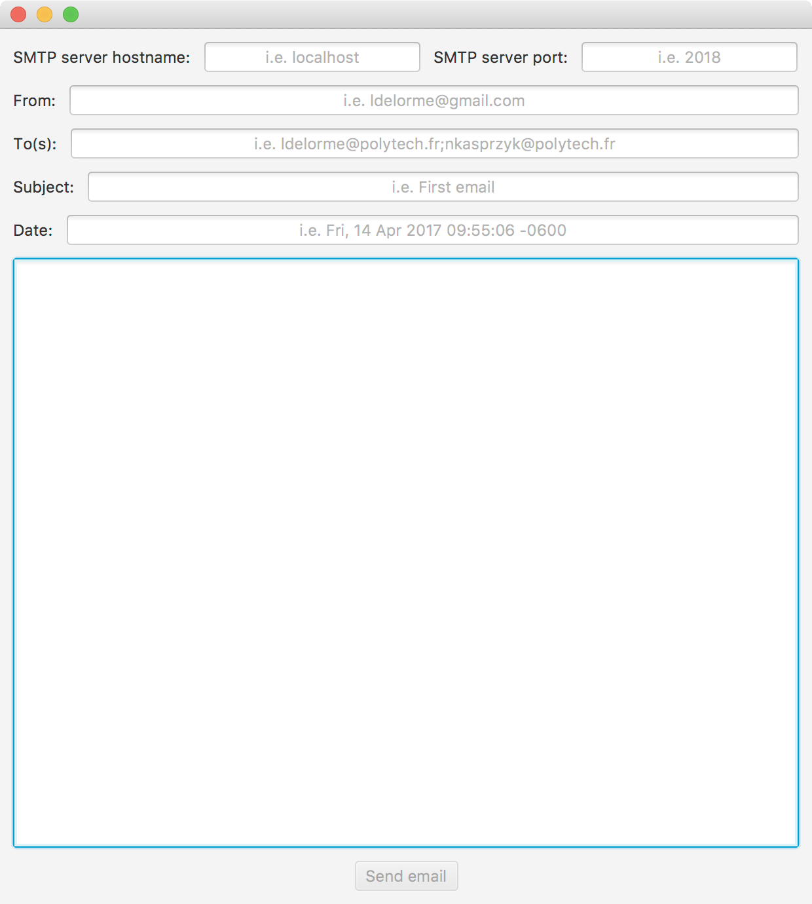

# Polytech-SMTP-Client

<b>General Information</b>
 
<table>
  <tr>
    <td><b>Language</b></td>
    <td>Java 8</td>
  </tr>
  <tr>
    <td><b>IDE</b></td>
    <td>Eclipse</td>
  </tr>
  <tr>
    <td><b>Libraries</b></td>
    <td>JavaFX</td>
  </tr>
</table>

<b>Screenshot(s)</b>
 
<table>
  <tr>
    <td></td>
  </tr>
  <tr>
    <td></td>
  </tr>
</table>